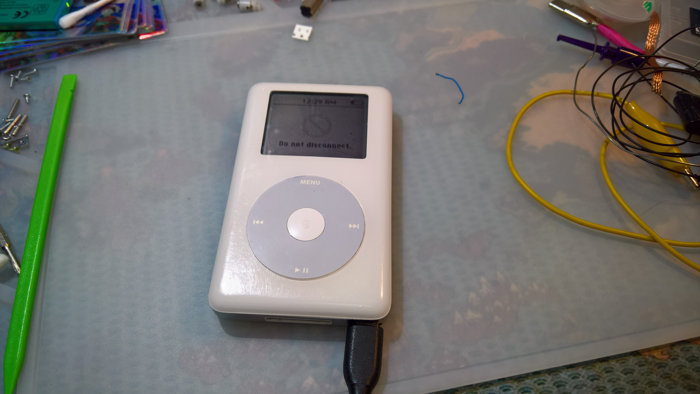
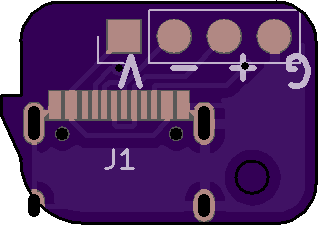
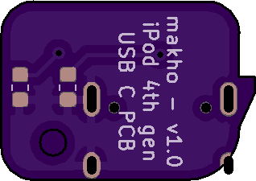
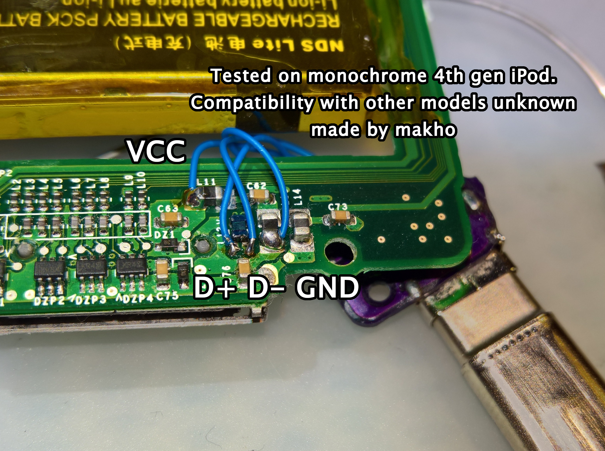

# ipod_usb_c
USB C Breakout board for iPod devices

There is currently only one version. It is designed and tested for the 4th generation iPod (monochrome). This board will likely work in the 4th generation Photo as well but it's untested. Electrically, it is compatible with any iPod that uses USB. Fitting it in other models, however, may be a different story. 

BOM: 

* Port needed is [TYPE-C-31-M-12](https://lcsc.com/product-detail/USB-Type-C_Korean-Hroparts-Elec-TYPE-C-31-M-12_C165948.html). 
* [OSHpark link to order PCBs](https://oshpark.com/shared_projects/0PFqSP8G) or you can upload the zip file in the gerbers directory to your preferred fab. 0.8mm thickness highly recommended.
* some short, thin wire (four strips about an inch or 25 mm long)
* 2x 5.1k 0603 resistors
* A small spacer -- I used a bit of broken plastic I had on my desk. This just makes it so the board sits flat over the click wheel FFC
* One longer PCB screw because the original screw is too short to go through the new board, spacer, and original board. I used a long GBA SP screw. 

The resistors are optional as long as you do not require USB C host compatibility. 

Here is how it can be wired on a 4th gen monochrome iPod

For the actual install, you will need a drill, some drill bits (final diameter 1/8th inch or approximately 3mm) and some needle files. This REQUIRES cutting a hole in the metal back of your iPod. Use calipers to measure what you need to cut for the opening. 

Otherwise you can see my video here: https://youtu.be/GwSPD8ESmN4
